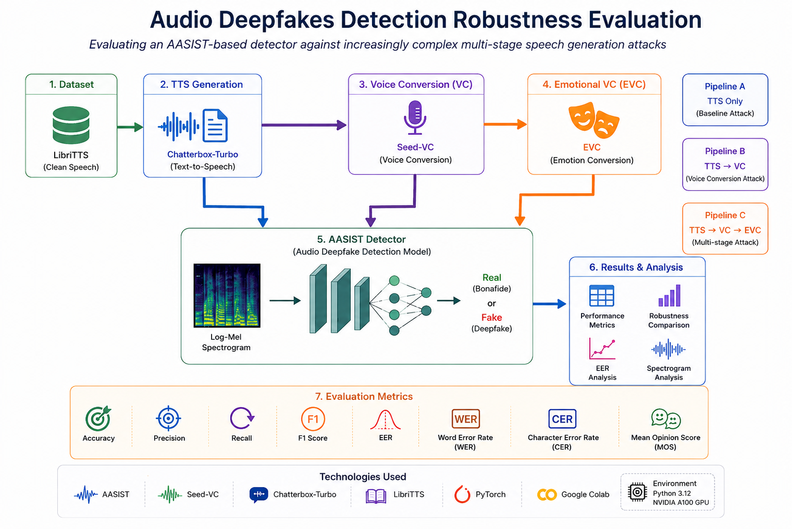

<p align="center">
  
</p>
# Audio Deepfakes Detection Robustness Evaluation

## Overview

This project investigates the robustness of modern audio deepfake detection systems against increasingly sophisticated multi-stage speech generation attacks.

An AASIST-based audio deepfake detector is trained using genuine speech and conventional Text-to-Speech (TTS) generated audio. The detector is then evaluated against progressively more complex attack pipelines involving Voice Conversion (VC) and Emotional Voice Conversion (EVC).

The objective is to determine whether a detector trained on standard synthetic speech can generalize to previously unseen multi-stage attacks and maintain reliable detection performance.

---

## Problem Statement

Most existing audio deepfake detectors are trained and evaluated using single-stage synthetic speech generated directly by Text-to-Speech systems.

However, real-world attackers can apply additional transformations such as:

- Voice Conversion (VC)
- Emotional Voice Conversion (EVC)
- Multi-stage generation pipelines

These transformations can significantly increase speech realism and potentially reduce detector effectiveness.

This project addresses the following research question:

> Can an audio deepfake detector trained on conventional TTS attacks remain robust when confronted with increasingly complex multi-stage speech generation pipelines?

---

## Objectives

The project aims to:

- Train an AASIST-based audio deepfake detector.
- Generate synthetic speech using Chatterbox-Turbo.
- Create Voice Conversion (VC) attacks using Seed-VC.
- Create Emotional Voice Conversion (EVC) attacks.
- Evaluate detector robustness under progressively harder attack scenarios.
- Analyze how detection performance changes as additional transformation stages are introduced.
- Identify limitations of current deepfake detection systems.

---

## Attack Pipelines

### Baseline

```
Text → Speech (TTS)
```

Generated using Chatterbox-Turbo.

### Voice Conversion Attack

```
Text → Speech (TTS) → Voice Conversion (VC)
```

Generated using Seed-VC.

### Emotional Voice Conversion Attack

```
Text → Speech (TTS)
      → Voice Conversion (VC)
      → Emotional Voice Conversion (EVC)
```

Generated using an emotion-controlled voice conversion pipeline.

---

## Technologies Used

| Component | Tool |
|------------|------------|
| Deepfake Detector | AASIST |
| TTS Generation | Chatterbox-Turbo |
| Voice Conversion | Seed-VC |
| Dataset | LibriTTS |
| Deep Learning Framework | PyTorch |
| Development Environment | Google Colab |
| Python Version | Python 3.12 |
| GPU | NVIDIA A100 |

---

## Project Structure

```text
Audio-Deepfakes-Detection
│
├── dataset
│   └── dataset_instructions.md
│
├── results
│   ├── robustness_results_vc.csv
│   ├── robustness_results_evc_david.csv
│   ├── robustness_results_evc_jennifer.csv
│   ├── robustness_results_evc_morgan.csv
│   └── mel_spectrograms
│
├── software_implementation
│   │
│   ├── aasist
│   │   ├── AASIST.py
│   │   ├── AASIST.conf
│   │   ├── data_utils.py
│   │   ├── main.py
│   │   └── AASIST_detector.ipynb
│   │
│   ├── generation
│   │   ├── seed-vc-generation.ipynb
│   │   └── EVC-generation.ipynb
│   │
│   └── evaluation
│       ├── WER_CER.ipynb
│       ├── MOS.ipynb
│       └── Mel_spectrogram_Plots.ipynb
│
├── unit_test_implementation
│   ├── test_data_utils.py
│   └── test_dataset.py
│
├── requirements.txt
└── README.md
```

---

## Installation

Clone the repository:

```bash
git clone https://github.com/SabaaMhmd/Audio-Deepfakes-Detection.git
cd Audio-Deepfakes-Detection
```

Install dependencies:

```bash
pip install -r requirements.txt
```

---

## Running Unit Tests

The project includes unit tests for core preprocessing and dataset functionality.

Run all tests:

```bash
pytest unit_test_implementation -v
```

Example output:

```text
4 passed in 2.06s
```

---

## Evaluation Metrics

The following metrics are used to evaluate detector performance:

### Classification Metrics

- Accuracy
- Precision
- Recall
- F1 Score
- Equal Error Rate (EER)

### Speech Quality Metrics

- Word Error Rate (WER)
- Character Error Rate (CER)
- Mean Opinion Score (MOS)

---

## Experimental Results

### Voice Conversion (VC)

The detector maintained strong performance against some VC attacks while showing substantial degradation against others.

Notably, attacks targeting the David Attenborough voice resulted in the largest performance drop, indicating a significant reduction in detector robustness.

### Emotional Voice Conversion (EVC)

Performance further deteriorated when emotional transformations were introduced.

Results demonstrate that adding emotional characteristics can significantly alter the acoustic properties learned by the detector and make classification more challenging.

These findings suggest that detectors trained exclusively on conventional TTS attacks may struggle to generalize to more advanced multi-stage generation pipelines.

---

## Mel-Spectrogram Analysis

To better understand acoustic differences between original and transformed speech, Mel-Spectrogram visualizations were generated for multiple attack scenarios.

### Morgan Freeman Example

#### Neutral Reference


#### Voice Conversion (VC)


#### Emotional Voice Conversion (EVC - Sad)


---

### David Attenborough Example

#### Angry Reference


#### Emotional Voice Conversion (EVC - Angry)


---

## Key Findings

- AASIST achieves strong performance on conventional synthetic speech.
- Voice Conversion attacks can substantially reduce detection accuracy.
- Emotional Voice Conversion introduces additional robustness challenges.
- Multi-stage attack pipelines expose limitations in detector generalization.
- Future detectors should be trained on a wider variety of attack types to improve robustness.

---

## Future Work

Potential extensions include:

- Training on VC and EVC attacks directly.
- Evaluating additional state-of-the-art detectors.
- Investigating adversarial robustness techniques.
- Expanding evaluation to multilingual datasets.
---

## Citation

If you use this repository or build upon this work, please cite the project appropriately.

---

## Authors

Developed as part of a graduation project focused on evaluating the robustness of audio deepfake detection systems against advanced speech generation attacks.
